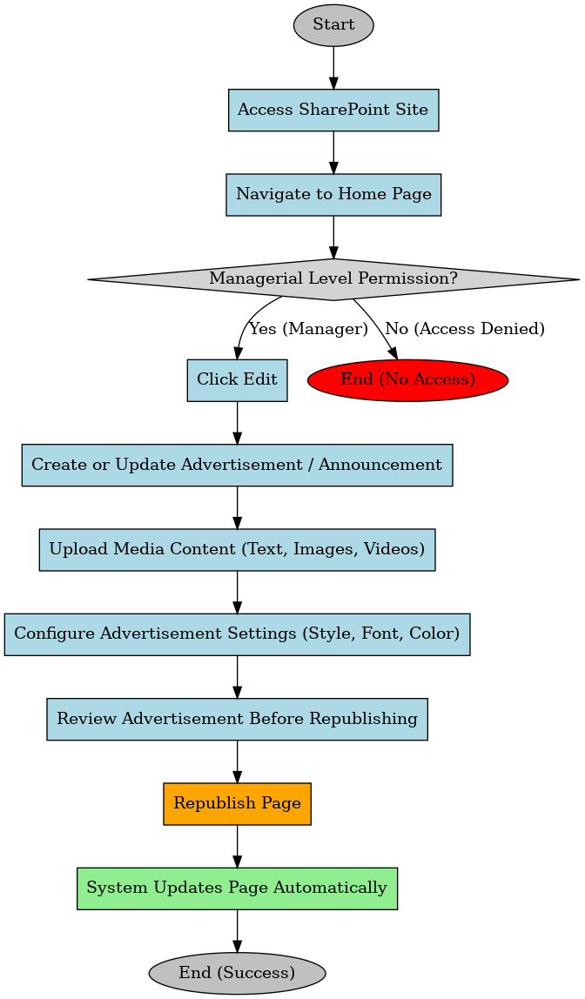

# Marketing & Promotion via SharePoint Team site

This process ensures that only authorized managers can update advertisements or announcements on the SharePoint home page, maintaining control over content changes. By implementing a structured workflow, it enhances content accuracy, prevents unauthorized modifications. Republishing the page ensures that updates are immediately reflected, keeping employees or clients informed with the latest announcements. This improves communication, streamlines content management, and enhances overall engagement by ensuring timely and relevant information is displayed. This process defines the steps for updating advertisements or announcements on a SharePoint site. It begins with the user accessing the site and navigating to the home page. A permission check ensures that only managers can proceed with edits. If access is granted, the manager clicks Edit, updates or creates an advertisement/ announcement, uploads media content, and adjusts formatting settings. Before finalizing, they review the changes and republish the page. The system then updates the page automatically, ensuring that the latest content is live. If the user lacks permission, the process ends without any changes being made.

**Use Case 1: *Advertise Events & New Menu Items***

**User:** Catering Manager / Operations Manager

**Steps:** 

1. The manager wants to promote a social event or new menu items to the university community.
2. They update the SharePoint site with event details, including images, descriptions, and dates.
3. Users visiting the SharePoint site (students, faculty, staff) can view the latest updates.

**Use Case 2**: ***Show Catering Availability to Clients***

**User:** Catering Manager / Operations Manager

**Steps:**

1. The manager wants to showcase availability for bookings and avoid schedule conflicts.
2. The Catering Manager updates Group Calendar on outlook to manage booking slots. Integrated with Shapoint site.
3. Users (event planners, faculty, student organizations) can view availability and plan bookings accordingly.
- **Workflow:**
    
    **Process Starts:** The user accesses the SharePoint Team site.
    
    1. **Navigate to Home Page** – The user navigates to the home page.
    2. **Managerial Level Permission Check** – The system checks if the user has managerial-level permissions.
        - **If Yes >** Proceed to the next step.
        - **If No >** Process ends with access denied.
    3. **Click Edit** – The manager clicks the Edit button to make changes.
    4. **Create or Update Advertisement / Announcement** – The manager updates the advertisement or announcement section.
    5. **Upload Media Content** – The manager adds text, images, or videos for the advertisement.
    6. **Configure Advertisement Settings** – The manager adjusts style, font, and color of the advertisement.
    7. **Review Advertisement Before Republishing** – The manager reviews the changes before proceeding.
    8. **Republish Page** – The manager republishes the page to reflect changes.
    9. **System Updates Page Automatically** – The system automatically updates the page with the new advertisement.
    10. **Process Ends (Success)** – The process completes successfully.

[SharePoint site for advertising.mp4](../Media/Videos/SharePoint_site_for_advertising.mp4)

### **Future Enhancement:**

- Integrate Power Automate to automate email notifications:
    - Trigger: Any time an event or menu update is published on SharePoint.
    - Action: Power Automate sends an email to predefined recipient groups.
    - Outcome: Ensures maximum event visibility without requiring manual email sending.
